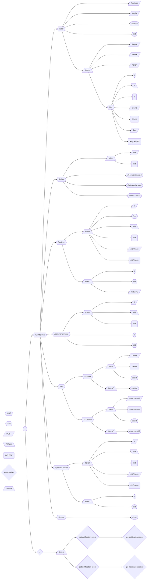
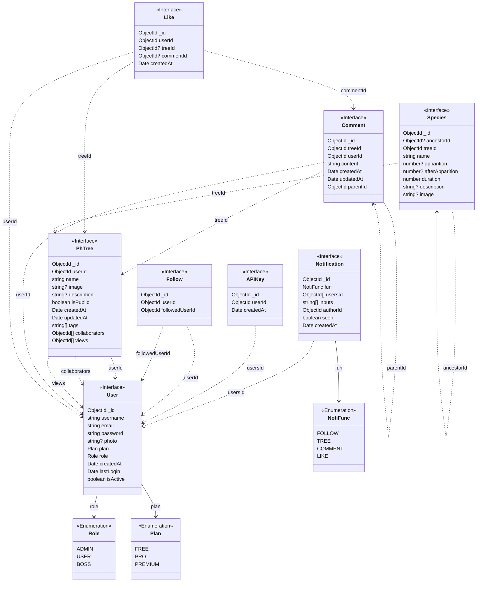

# Life Tree API

## Index

- [Routes Diagram](#routes-diagram)
- [Database Model](#database-model)
- [Enums](#enums)
- [Environment](#environment)
  - [Variables](#variables)
  - [Secrets](#secrets)
- [Endpoints](#endpoints)
  - [Route `/user`](#route-user)
    - [`POST /register`](#post-register)
    - [`POST /login`](#post-login)
    - [`GET /search`](#get-search)
    - [`GET /:id`](#get-id)
    - [`POST /logout`](#post-logout)
    - [`POST /admin`](#post-admin)
    - [`POST /token`](#post-token)
    - [Route `/me`](#route-me)
      - [`GET /`](#get-)
      - [`PATCH /`](#patch-)
      - [`DELETE /`](#delete-)
      - [`POST /photo`](#post-photo)
      - [`DELETE /photo`](#delete-photo)
      - [`POST /key`](#post-key)
      - [`DELETE /key/:keyTD`](#delete-keykeytd)
  - [Route `/follow`](#route-follow)
    - [`POST /:id`](#post-id)
    - [`DELETE /:id`](#delete-id)
    - [`GET /followers/:userId`](#get-followersuserid)
    - [`GET /following/:userId`](#get-followinguserid)
    - [`GET /count/:userId`](#get-countuserid)
  - [Route `/ph-tree`](#route-ph-tree)
    - [`POST /`](#post-)
    - [`GET /me`](#get-me)
    - [`PATCH /:id`](#patch-id)
    - [`DELETE /:id`](#delete-id-1)
    - [`POST /:id/image`](#post-idimage)
    - [`DELETE /:id/image`](#delete-idimage)
    - [`GET /`](#get--1)
    - [`GET /:id`](#get-id-1)
  - [Route `/comment`](#route-comment)
    - [`POST /:treeId`](#post-treeid)
    - [`PATCH /:treeId/:id`](#patch-treeidid)
    - [`DELETE /:treeId/:id`](#delete-treeidid)
    - [`GET /:treeId`](#get-treeid)
    - [`GET /:treeId/:id`](#get-treeidid)
  - [Route `/like`](#route-like)
    - [Route `/ph-tree`](#route-ph-tree-1)
      - [`POST /:treeId`](#post-treeid-1)
      - [`DELETE /:treeId`](#delete-treeid)
      - [`GET /liked`](#get-liked)
      - [`GET /:treeId`](#get-treeid-1)
    - [Route `/comment`](#route-comment-1)
      - [`POST /:commentId`](#post-commentid)
      - [`DELETE /:commentId`](#delete-commentid)
      - [`GET /liked`](#get-liked-1)
      - [`GET /:commentId`](#get-commentid)
  - [Route `/species`](#route-species)
    - [`POST /:treeId`](#post-treeid-2)
    - [`PATCH /:treeId/:id`](#patch-treeidid-1)
    - [`DELETE /:treeId/:id`](#delete-treeidid-1)
    - [`POST /:treeId/:id/image`](#post-treeididimage)
    - [`DELETE /:treeId/:id/image`](#delete-treeididimage)
    - [`GET /:treeId`](#get-treeid-2)
    - [`GET /:treeId/:id`](#get-treeidid-1)
  - [`GET /image/:img`](#get-imageimg)
- [Web Socket](#web-socket)
  - [`on("set-notification-client")`](#onset-notification-client)
  - [`on("get-notification-client")`](#onget-notification-client)

## Routes Diagram



## Database Model

This API uses a NOSQL database (MongoDB):



## Enums

```typescript
export enum NotiFunc {
  FOLLOW = "follow",
  TREE = "tree",
  COMMENT = "comment",
  LIKE = "like",
}

export enum Role {
  ADMIN = "admin",
  USER = "user",
  BOSS = "boss",
}

export enum Plan {
  FREE = "free",
  PRO = "pro",
  PREMIUM = "premium",
}

export enum TreeCriteria {
  CREATED_AT = "createdAt",
  UPDATED_AT = "updatedAt",
  LIKES = "likes",
  COMMENTS = "comments",
  NAME = "name",
}

export enum Order {
  ASC = "asc",
  DESC = "desc",
}
```

## Environment

### Variables

```
PORT
JWT_EXPIRATION
IMAGES_URL
ACCEPTED_ORIGINS
BASE_URL
CLOUDINARY_CLOUD_NAME
CLOUDINARY_API_KEY
```

### Secrets

```
MONGO_URL
JWT_SECRET
CLOUDINARY_SECRET_KEY
```

## Endpoints

**Base Url:**

`/api/life-tree`

### Route `/user`

#### `POST /register`

Create a new user

**Query:**

- `?apiKey`: API Key

**Body:**

```json
{
  "email": "${string}@${string}.${string}",
  "password": "string",
  "username": "string"
}
```

**Response:**

```json
{
  "id": "ObjectId",
  "email": "${string}@${string}.${string}",
  "username": "string",
  "photo": "string | undefined",
  "plan": "Plan",
  "role": "Role",
  "createdAt": "Date",
  "lastLogin": "Date",
  "isActive": "boolean | undefined",
  "apiKeys": ["ObjectId"]
}
```

Cookie: `token=`

#### `POST /login`

Log in with an existing account

**Query:**

- `?apiKey`: API Key

**Body:**

```json
{
  "email": "${string}@${string}.${string}",
  "password": "string"
}
```

**Response:**

```json
{
  "id": "ObjectId",
  "email": "${string}@${string}.${string}",
  "username": "string",
  "photo": "string | undefined",
  "plan": "Plan",
  "role": "Role",
  "createdAt": "Date",
  "lastLogin": "Date",
  "isActive": "boolean | undefined",
  "apiKeys": ["ObjectId"]
}
```

Cookie: `token=`

#### `GET /search`

Search for users

**Query:**

- `?search`: Searching by name
- `?limit`: Maximum results

**Response:**

```json
[
  {
    "id": "ObjectId",
    "email": "${string}@${string}.${string}",
    "username": "string",
    "photo": "string | undefined",
    "plan": "Plan",
    "role": "Role",
    "createdAt": "Date",
    "lastLogin": "Date",
    "isActive": "boolean | undefined"
  }
]
```

#### `GET /:id`

Get info about an specific user

**Params:**

- `/:id`: Id of the user

**Response:**

```json
{
  "id": "ObjectId",
  "email": "${string}@${string}.${string}",
  "username": "string",
  "photo": "string | undefined",
  "plan": "Plan",
  "role": "Role",
  "createdAt": "Date",
  "lastLogin": "Date",
  "isActive": "boolean | undefined"
}
```

#### `POST /logout`

Log out from your account

**Query:**

- `?apiKey`: API Key

**Cookie:**

- `token=`: JSON Web Token

**Response:**

```json
{
  "message": "Logged out successfully"
}
```

#### `POST /admin`

Make an user to be an admin (`admin.role = Role.ADMIN`) or make an admin to be an user (`admin.role = Role.USER`) (only allowed if `user.role === Role.BOSS`)

**Query:**

- `?apiKey`: API Key

**Cookie:**

- `token=`: JSON Web Token

**Body:**

```json
{
  "adminId": "string",
  "removeAdmin": "boolean | undefined"
}
```

#### `POST /token`

**Query:**

- `?apiKey`: API Key

**Cookie:**

- `token=`: JSON Web Token

**Body:**

```json
{
  "expiresIn": "number | string | undefined"
}
```

**Response:**

```json
{
  "message": "Token generated successfully"
}
```

Cookie: `token=`

#### Route `/me`

##### `GET /`

Get info about your user

**Cookie:**

- `token=`: JSON Web Token

**Response:**

```json
{
  "id": "ObjectId",
  "email": "${string}@${string}.${string}",
  "username": "string",
  "photo": "string | undefined",
  "plan": "Plan",
  "role": "Role",
  "createdAt": "Date",
  "lastLogin": "Date",
  "isActive": "boolean | undefined",
  "apiKeys": ["ObjectId"]
}
```

##### `PATCH /`

Updates data about your account

**Query:**

- `?apiKey`: API Key

**Cookie:**

- `token=`: JSON Web Token

**Body:**

```json
{
  "username": "string | undefined",
  "oldPassword": "string | undefined",
  "password": "string | undefined",
  "plan": "Plan | undefined"
}
```

**Response:**

```json
{
  "id": "ObjectId",
  "email": "${string}@${string}.${string}",
  "username": "string",
  "photo": "string | undefined",
  "plan": "Plan",
  "role": "Role",
  "createdAt": "Date",
  "lastLogin": "Date",
  "isActive": "boolean | undefined",
  "apiKeys": ["ObjectId"]
}
```

##### `DELETE /`

Deletes your account permanently

**Query:**

- `?apiKey`: API Key

**Cookie:**

- `token=`: JSON Web Token

**Response:**

```json
{
  "message": "User deleted successfully"
}
```

##### `POST /photo`

Set your profile picture

**Query:**

- `?apiKey`: API Key

**Cookie:**

- `token=`: JSON Web Token

**File:**

- `image`: Image file (jpg, jpeg, png, gif)

**Response:**

```json
{
  "id": "ObjectId",
  "email": "${string}@${string}.${string}",
  "username": "string",
  "photo": "string | undefined",
  "plan": "Plan",
  "role": "Role",
  "createdAt": "Date",
  "lastLogin": "Date",
  "isActive": "boolean | undefined",
  "apiKeys": ["ObjectId"]
}
```

##### `DELETE /photo`

Set your profile picture as `null | undefined`

**Query:**

- `?apiKey`: API Key

**Cookie:**

- `token=`: JSON Web Token

**Response:**

```json
{
  "id": "ObjectId",
  "email": "${string}@${string}.${string}",
  "username": "string",
  "photo": "string | undefined",
  "plan": "Plan",
  "role": "Role",
  "createdAt": "Date",
  "lastLogin": "Date",
  "isActive": "boolean | undefined",
  "apiKeys": ["ObjectId"]
}
```

##### `POST /key`

Create a new API Key (only valid if `user.role === Role.ADMIN || user.role === Role.BOSS`)

**Query:**

- `?apiKey`: API Key

**Cookie:**

- `token=`: JSON Web Token

**Response:**

```json
{
  "apiKey": "ObjectId"
}
```

##### `DELETE /key/:keyTD`

Delete an API Key (only valid if `user.role === Role.ADMIN || user.role === Role.BOSS`)

**Query:**

- `?apiKey`: API Key

**Params:**

- `/:keyTD`: Key to delete

**Cookie:**

- `token=`: JSON Web Token

**Response:**

```json
{
  "message": "Key deleted successfully"
}
```

### Route `/follow`

#### `POST /:id`

Follow a user

**Query:**

- `?apiKey`: API Key

**Params:**

- `/:id`: Id of the user

**Cookie:**

- `token=`: JSON Web Token

**Response:**

```json
{
  "id": "ObjectId",
  "userId": "ObjectId",
  "followedUserId": "ObjectId"
}
```

#### `DELETE /:id`

Unfollow a user

**Query:**

- `?apiKey`: API Key

**Params:**

- `/:id`: Id of the user

**Cookie:**

- `token=`: JSON Web Token

**Response:**

```json
{
  "message": "User unfollowed successfully"
}
```

#### `GET /followers/:userId`

Get the users who follow a specific user

**Params:**

- `/:userId`: Id of the user

**Response:**

```json
[
  {
    "id": "ObjectId",
    "email": "${string}@${string}.${string}",
    "username": "string",
    "photo": "string | undefined",
    "role": "Role",
    "lastLogin": "Date | undefined",
    "isActive": "boolean | undefined"
  }
]
```

#### `GET /following/:userId`

Get the users followed by a specific user

**Params:**

- `/:userId`: Id of the user

**Response:**

```json
[
  {
    "id": "ObjectId",
    "email": "${string}@${string}.${string}",
    "username": "string",
    "photo": "string | undefined",
    "role": "Role",
    "lastLogin": "Date | undefined",
    "isActive": "boolean | undefined"
  }
]
```

#### `GET /count/:userId`

Get the followers number of a specific user

**Params:**

- `/:userId`: Id of the user

**Response:**

```json
{
  "count": "number"
}
```

### Route `/ph-tree`

#### `POST /`

Create a new Ph. Tree (Phylogenetic Tree)

**Query:**

- `?apiKey`: API Key

**Cookie:**

- `token=`: JSON Web Token

**Body:**

```json
{
  "name": "string",
  "description": "string | undefined",
  "isPublic": "boolean",
  "tags": ["string"],
  "collaborators": ["string"]
}
```

**Response:**

```json
{
  "id": "ObjectId",
  "userId": "ObjectId",
  "name": "string",
  "image": "string | undefined",
  "description": "string | undefined",
  "isPublic": "boolean",
  "createdAt": "Date",
  "updatedAt": "Date",
  "tags": ["string"],
  "collaborators": ["string"],
  "likes": "number",
  "comments": "number",
  "views": "number"
}
```

#### `GET /me`

Search your Ph. Trees

**Query:**

- `?page`: Page of the result
- `?limit`: Results per page
- `?search`: Searching by tags, name or user
- `?criteria`: Sorting criteria (`"createdAt", "updatedAt", "likes", "comments", "name"`)
- `?order`: Sorting order (`"asc", "desc"`)
- `?from`: Minimum createdAt
- `?to`: Maximum createdAt

**Cookie:**

- `token=`: JSON Web Token

**Response:**

```json
[
  {
    "id": "ObjectId",
    "userId": "ObjectId",
    "name": "string",
    "image": "string | undefined",
    "description": "string | undefined",
    "isPublic": "boolean",
    "createdAt": "Date",
    "updatedAt": "Date",
    "tags": ["string"],
    "collaborators": ["string"],
    "likes": "number",
    "comments": "number",
    "views": "number"
  }
]
```

#### `PATCH /:id`

Modify a Ph. Tree

**Query:**

- `?apiKey`: API Key

**Params:**

- `/:id`: Id of the tree

**Cookie:**

- `token=`: JSON Web Token

**Body:**

```json
{
  "name": "string | undefined",
  "description": "string | undefined",
  "isPublic": "boolean | undefined",
  "tags": "string[] | undefined",
  "tags": ["string"],
  "collaborators": ["string"]
}
```

**Response:**

```json
{
  "id": "ObjectId",
  "userId": "ObjectId",
  "name": "string",
  "image": "string | undefined",
  "description": "string | undefined",
  "isPublic": "boolean",
  "createdAt": "Date",
  "updatedAt": "Date",
  "tags": ["string"],
  "collaborators": ["string"],
  "likes": "number",
  "comments": "number",
  "views": "number"
}
```

#### `DELETE /:id`

Delete a Ph. Tree permanently

**Query:**

- `?apiKey`: API Key

**Params:**

- `/:id`: Id of the tree

**Cookie:**

- `token=`: JSON Web Token

**Response:**

```json
{
  "message": "Tree deleted successfully"
}
```

#### `POST /:id/image`

Set the Ph. Tree's image

**Query:**

- `?apiKey`: API Key

**Params:**

- `/:id`: Id of the tree

**Cookie:**

- `token=`: JSON Web Token

**File:**

- `image`: Image file (jpg, jpeg, png, gif)

**Response:**

```json
{
  "id": "ObjectId",
  "userId": "ObjectId",
  "name": "string",
  "image": "string | undefined",
  "description": "string | undefined",
  "isPublic": "boolean",
  "createdAt": "Date",
  "updatedAt": "Date",
  "tags": ["string"],
  "collaborators": ["string"],
  "likes": "number",
  "comments": "number",
  "views": "number"
}
```

#### `DELETE /:id/image`

Set the Ph. Tree's image as `null | undefined`

**Query:**

- `?apiKey`: API Key

**Params:**

- `/:id`: Id of the tree

**Cookie:**

- `token=`: JSON Web Token

**Response:**

```json
{
  "id": "ObjectId",
  "userId": "ObjectId",
  "name": "string",
  "image": "string | undefined",
  "description": "string | undefined",
  "isPublic": "boolean",
  "createdAt": "Date",
  "updatedAt": "Date",
  "tags": ["string"],
  "collaborators": ["string"],
  "likes": "number",
  "comments": "number",
  "views": "number"
}
```

#### `GET /`

Search Ph. Trees made by other users

**Query:**

- `?page`: Page of the result
- `?limit`: Results per page
- `?search`: Searching by tags, name or user
- `?criteria`: Sorting criteria (`"createdAt", "updatedAt", "likes", "comments", "name"`)
- `?order`: Sorting order (`"asc", "desc"`)

**Cookie:**

- `token=`: JSON Web Token

**Response:**

```json
[
  {
    "id": "ObjectId",
    "userId": "ObjectId",
    "name": "string",
    "image": "string | undefined",
    "description": "string | undefined",
    "isPublic": "boolean",
    "createdAt": "Date",
    "updatedAt": "Date",
    "tags": ["string"],
    "collaborators": ["string"],
    "likes": "number",
    "comments": "number",
    "views": "number"
  }
]
```

#### `GET /:id`

**Params:**

- `/:id`: Id of the tree

**Cookie:**

- `token=`: JSON Web Token

**Response:**

```json
{
  "id": "ObjectId",
  "userId": "ObjectId",
  "name": "string",
  "image": "string | undefined",
  "description": "string | undefined",
  "isPublic": "boolean",
  "createdAt": "Date",
  "updatedAt": "Date",
  "tags": ["string"],
  "collaborators": ["string"],
  "likes": "number",
  "comments": "number",
  "views": "number"
}
```

#### `POST /:id/view`

Indicate you've seen a Ph. Tree

**Query:**

- `?apiKey`: API Key

**Params:**

- `/:id`: Id of the tree

**Cookie:**

- `token=`: JSON Web Token

**Response:**

```json
{
  "views": "number"
}
```

### Route `/comment`

#### `POST /:treeId`

Comment a Ph. Tree or resply an existing comment

**Query:**

- `?apiKey`: API Key

**Params:**

- `/:treeId`: Id of the tree

**Cookie:**

- `token=`: JSON Web Token

**Body:**

```json
{
  "content": "string",
  "parentId": "string | undefined"
}
```

**Response:**

```json
{
  "id": "ObjectId",
  "treeId": "ObjectId",
  "userId": "ObjectId",
  "content": "string | undefined",
  "createdAt": "Date",
  "updatedAt": "Date",
  "replies": ["..."]
}
```

#### `PATCH /:treeId/:id`

Update an existing comment

**Query:**

- `?apiKey`: API Key

**Params:**

- `/:treeId`: Id of the tree
- `/:id`: Id of the comment

**Cookie:**

- `token=`: JSON Web Token

**Body:**

```json
{
  "content": "string | undefined"
}
```

**Response:**

```json
{
  "id": "ObjectId",
  "treeId": "ObjectId",
  "userId": "ObjectId",
  "content": "string | undefined",
  "createdAt": "Date",
  "updatedAt": "Date",
  "replies": ["..."]
}
```

#### `DELETE /:treeId/:id`

Delete an existing comment permanently (if `comment.replies?.length > 0`, it only deletes the `comment.userId` and `comment.content`)

**Query:**

- `?apiKey`: API Key

**Params:**

- `/:treeId`: Id of the tree
- `/:id`: Id of the comment

**Cookie:**

- `token=`: JSON Web Token

**Response:**

```json
{
  "message": "Comment deleted successfully"
}
```

#### `GET /:treeId`

Get the comments in a Ph. Tree

**Params:**

- `/:treeId`: Id of the tree

**Response:**

```json
[
  {
    "id": "ObjectId",
    "treeId": "ObjectId",
    "userId": "ObjectId",
    "content": "string | undefined",
    "createdAt": "Date",
    "updatedAt": "Date",
    "replies": ["..."]
  }
]
```

#### `GET /:treeId/:id`

Get a specific comment

**Params:**

- `/:treeId`: Id of the tree
- `/:id`: Id of the comment

**Response:**

```json
{
  "id": "ObjectId",
  "treeId": "ObjectId",
  "userId": "ObjectId",
  "content": "string | undefined",
  "createdAt": "Date",
  "updatedAt": "Date",
  "replies": ["..."]
}
```

### Route `/like`

#### Route `/ph-tree`

##### `POST /:treeId`

Like a Ph. Tree

**Query:**

- `?apiKey`: API Key

**Params:**

- `/:treeId`: Id of the tree

**Cookie:**

- `token=`: JSON Web Token

**Response:**

```json
{
  "id": "ObjectId",
  "userId": "ObjectId",
  "treeId": "ObjectId | undefined",
  "commentId": "ObjectId | undefined",
  "createdAt": "Date"
}
```

##### `DELETE /:treeId`

Unlike a Ph. Tree

**Query:**

- `?apiKey`: API Key

**Params:**

- `/:treeId`: Id of the tree

**Cookie:**

- `token=`: JSON Web Token

**Response:**

```json
{
  "message": "Like deleted successfully"
}
```

##### `GET /liked`

Get the trees you liked

**Cookie:**

- `token=`: JSON Web Token

**Response:**

```json
[
  {
    "id": "ObjectId",
    "userId": "ObjectId",
    "name": "string",
    "image": "string | undefined",
    "description": "string | undefined",
    "isPublic": "boolean",
    "createdAt": "Date",
    "updatedAt": "Date",
    "tags": ["string"],
    "collaborators": ["string"]
  }
]
```

##### `GET /:treeId`

Get the number of likes of a Ph. Tree

**Params:**

- `/:treeId`: Id of the tree

**Cookie:**

- `token=`: JSON Web Token

**Response:**

```json
{
  "likesCount": "number",
  "myLike": "boolean | undefined"
}
```

#### Route `/comment`

##### `POST /:commentId`

Like a comment

**Query:**

- `?apiKey`: API Key

**Params:**

- `/:commentId`: Id of the comment

**Cookie:**

- `token=`: JSON Web Token

**Response:**

```json
{
  "id": "ObjectId",
  "userId": "ObjectId",
  "treeId": "ObjectId | undefined",
  "commentId": "ObjectId | undefined",
  "createdAt": "Date"
}
```

##### `DELETE /:commentId`

Unlike a comment

**Query:**

- `?apiKey`: API Key

**Params:**

- `/:treeId`: Id of the comment

**Cookie:**

- `token=`: JSON Web Token

**Response:**

```json
{
  "message": "Like deleted successfully"
}
```

##### `GET /liked`

Get the comments you liked

**Cookie:**

- `token=`: JSON Web Token

**Response:**

```json
[
  {
    "id": "ObjectId",
    "treeId": "ObjectId",
    "userId": "ObjectId",
    "content": "string | undefined",
    "createdAt": "Date",
    "updatedAt": "Date",
    "replies": ["..."]
  }
]
```

##### `GET /:commentId`

Get the number of likes of a comment

**Params:**

- `/:commentId`: Id of the comment

**Cookie:**

- `token=`: JSON Web Token

**Response:**

```json
{
  "likesCount": "number",
  "myLike": "boolean | undefined"
}
```

### Route `/species`

#### `POST /:treeId`

Create a new species

**Query:**

- `?apiKey`: API Key

**Params:**

- `/:treeId`: Id of the tree

**Cookie:**

- `token=`: JSON Web Token

**Body:**

```json
{
  "name": "string",
  "duration": "number",
  "ancestorId": "string | undefined",
  "apparition": "number | undefined",
  "afterApparition": "number | undefined",
  "description": "string | undefined",
  "descendants": ["..."]
}
```

**Response:**

```json
{
  "id": "ObjectId",
  "treeId": "ObjectId",
  "name": "string",
  "duration": "number",
  "ancestorId": "ObjectId | undefined",
  "apparition": "number | undefined",
  "afterApparition": "number | undefined",
  "description": "string | undefined",
  "image": "string | undefined",
  "descendants": ["..."]
}
```

#### `PATCH /:treeId/:id`

Update an existing species

**Query:**

- `?apiKey`: API Key

**Params:**

- `/:treeId`: Id of the tree
- `/:id`: Id of the comment

**Cookie:**

- `token=`: JSON Web Token

**Body:**

```json
{
  "name": "string | undefined",
  "duration": "number | undefined",
  "ancestorId": "string | null | undefined",
  "apparition": "number | undefined",
  "afterApparition": "number | undefined",
  "description": "string | undefined",
  "descendants": ["..."]
}
```

**Response:**

```json
{
  "id": "ObjectId",
  "treeId": "ObjectId",
  "name": "string",
  "duration": "number",
  "ancestorId": "ObjectId | undefined",
  "apparition": "number | undefined",
  "afterApparition": "number | undefined",
  "description": "string | undefined",
  "image": "string | undefined",
  "descendants": ["..."]
}
```

#### `DELETE /:treeId/:id`

Delete a species and its descendants permanently

**Query:**

- `?apiKey`: API Key

**Params:**

- `/:treeId`: Id of the tree
- `/:id`: Id of the comment

**Cookie:**

- `token=`: JSON Web Token

**Response:**

```json
{
  "message": "Species deleted successfully"
}
```

#### `POST /:treeId/:id/image`

Set the species' image

**Query:**

- `?apiKey`: API Key

**Params:**

- `/:treeId`: Id of the tree
- `/:id`: Id of the comment

**Cookie:**

- `token=`: JSON Web Token

**File:**

- `image`: Image file (jpg, jpeg, png, gif)

**Response:**

```json
{
  "id": "ObjectId",
  "treeId": "ObjectId",
  "name": "string",
  "duration": "number",
  "ancestorId": "ObjectId | undefined",
  "apparition": "number | undefined",
  "afterApparition": "number | undefined",
  "description": "string | undefined",
  "image": "string | undefined",
  "descendants": ["..."]
}
```

#### `DELETE /:treeId/:id/image`

Set the species' image as `null | undefined`

**Query:**

- `?apiKey`: API Key

**Params:**

- `/:treeId`: Id of the tree

**Cookie:**

- `token=`: JSON Web Token

**Response:**

```json
{
  "id": "ObjectId",
  "treeId": "ObjectId",
  "name": "string",
  "duration": "number",
  "ancestorId": "ObjectId | undefined",
  "apparition": "number | undefined",
  "afterApparition": "number | undefined",
  "description": "string | undefined",
  "image": "string | undefined",
  "descendants": ["..."]
}
```

#### `GET /:treeId`

Get the species of a specific Ph. Tree

**Params:**

- `/:treeId`: Id of the tree
- `/:id`: Id of the comment

**Cookie:**

- `token=`: JSON Web Token

**Response:**

```json
[
  {
    "id": "ObjectId",
    "treeId": "ObjectId",
    "name": "string",
    "duration": "number",
    "ancestorId": "ObjectId | undefined",
    "apparition": "number | undefined",
    "afterApparition": "number | undefined",
    "description": "string | undefined",
    "image": "string | undefined",
    "descendants": ["..."]
  }
]
```

#### `GET /:treeId/:id`

Get a specific species and its descendants

**Params:**

- `/:treeId`: Id of the tree
- `/:id`: Id of the comment

**Cookie:**

- `token=`: JSON Web Token

**Response:**

```json
[
  {
    "id": "ObjectId",
    "treeId": "ObjectId",
    "name": "string",
    "duration": "number",
    "ancestorId": "ObjectId | undefined",
    "apparition": "number | undefined",
    "afterApparition": "number | undefined",
    "description": "string | undefined",
    "image": "string | undefined",
    "descendants": ["..."]
  }
]
```

### `GET /image/:img`

Get an image by name

**Params:**

- `/:img`: Name of the image

**Response:**

Image file (jpg, jpeg, png, gif)

## Web Socket

### `on("set-notification-client")`

**Cookie:**

- `token=`: JSON Web Token

**Data:**

```json
{
  "fun": "NotiFunc",
  "followedUserId": "string | undefined",
  "treeId": "string | undefined",
  "commentId": "string | undefined"
}
```

**Response:**

`emit("set-notification-server")`

```json
{
  "id": "ObjectId",
  "fun": "NotiFunc",
  "usersId": "ObjectId[]",
  "inputs": "string[]",
  "authorId": "ObjectId",
  "seen": "boolean",
  "createdAt": "Date"
}
```

### `on("get-notification-client")`

**Cookie:**

- `token=`: JSON Web Token

**Data:**

```json
{
  "from": "Date | undefined",
  "limit": "number | undefined",
  "see": "boolean | undefined"
}
```

**Response:**

`emit("get-notification-server")`

```json
[
  {
    "id": "ObjectId",
    "fun": "NotiFunc",
    "usersId": "ObjectId[]",
    "inputs": "string[]",
    "authorId": "ObjectId",
    "seen": "boolean",
    "createdAt": "Date"
  }
]
```
